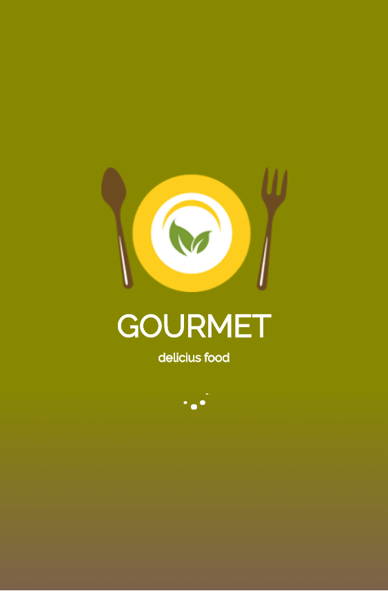
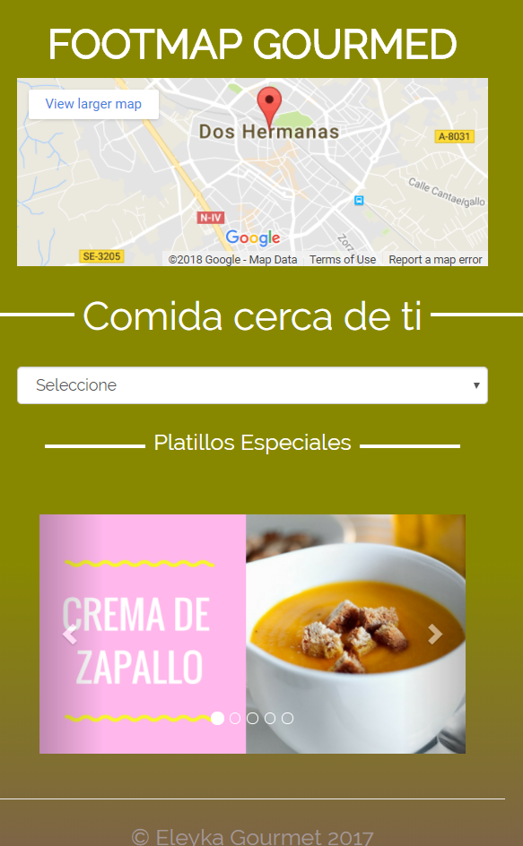
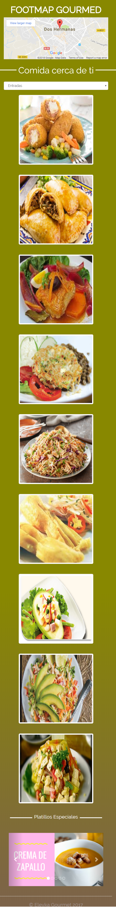
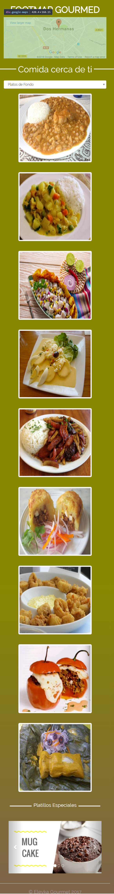
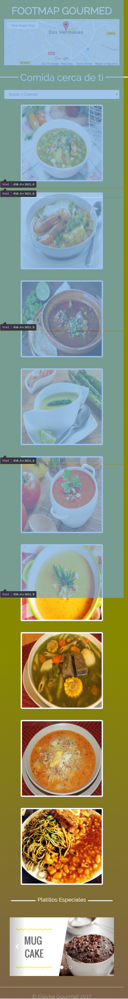
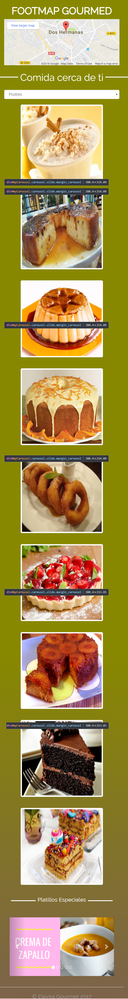
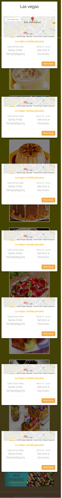

# FOOTMAP - "JQUERY"

 ```bash
   Eleyne Karina Ramírez De la Cruz
   ```

## Objetivo
  Recrear la  página web de Foodmap (First Mobile) aplicando JQUERY.
## Ventajas del uso de Jquery
* Facilita la manera de interactuar con los documentos HTML
* Manipulación del DOM
* Manejar eventos
* Desarrollar animaciones
* Agregar interacciones con AJAX
## Resultado

* **Flujo de aplicación**
***


* **Página principal**
***

* **Filtro**
***




* **Efecto Mouseover**
***


* **Modal - Especificación de los restaurantes**
***

